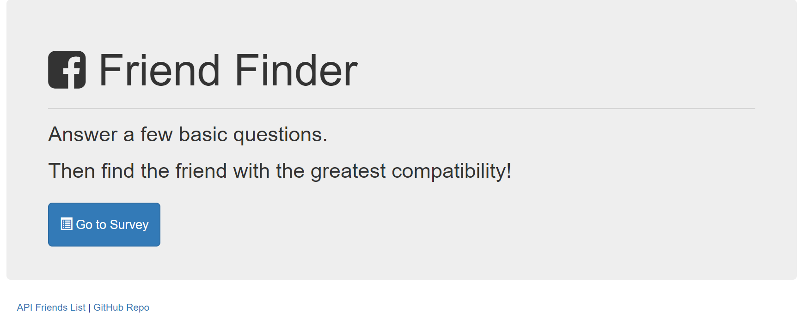
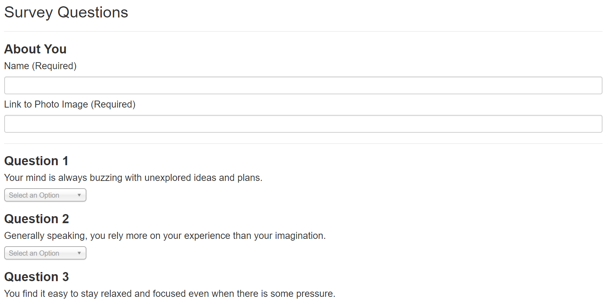
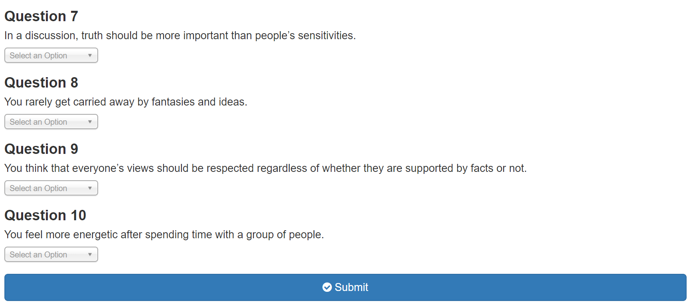

# Friend-Finder

## Overview

This is a compatibility-based "FriendFinder" application -- basically a dating app. This full-stack site will take in results from your users' surveys, then compare their answers with those from other users. The app will then display the name and picture of the user with the best overall match.

##Implementation

This app uses Express to handle routing. It is deployed on Heroku at https://friend-finder-jdp.herokuapp.com/.

##Screen Shots

Figure 1: Homescreen for Friend Finder

Figure 2: Survey Page - Select questions in drop-down (on a scale from 1 to 5)

Figure 3: Press "Submit" to enter your questions to the Friend Finder Compatibility Algorithm.